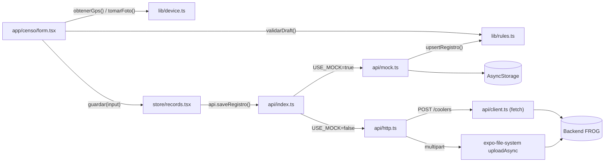
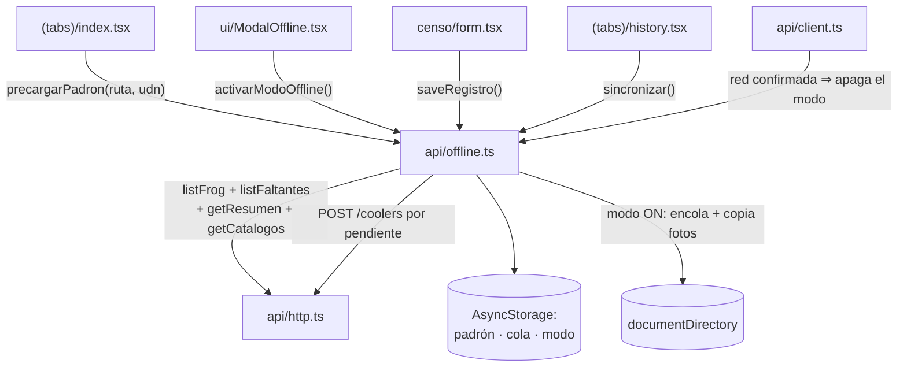

# 🏗️ Cómo está Pensado

## Patrón arquitectónico

**Capas por responsabilidad, con un puerto/adaptador (Ports & Adapters) en el borde de datos.**

No es Clean Architecture "de libro" ni MVC clásico. Es más simple: cuatro capas horizontales
(`app/` → `store/` → `lib/` → `api/`) más un punto único de inversión de dependencia en
`src/api/index.ts`, que decide en tiempo de ejecución si `api` es la implementación mock o la HTTP.

**Por qué esta forma y no otra:**

- La app tiene que poder desarrollarse y probarse **sin backend** (Expo Go, sin red, en un
  emulador), y el swap a producción debe ser "cambiar una variable de entorno", no "reescribir
  pantallas". Eso exige que el contrato de datos (`CensoApi`) esté desacoplado de quien lo consume.
- El dominio tiene **reglas de negocio no triviales** (§5, §6, §8, §9, §10, §12 del spec) que deben
  poder verificarse sin levantar la app ni un simulador. Por eso viven en `src/lib/rules.ts` como
  funciones puras, ejecutables con Node puro (`npm run check`).
- El backend real habla **otro idioma** que el dominio: llaves en MAYÚSCULAS (`RAZONSOCIAL`), enums
  sin acento (`CORRECCION`), estados con guion bajo (`USADO_DISPONIBLE`). Ese ruido se contiene
  entero en `src/api/http.ts`; ninguna pantalla lo ve.

## Capas / módulos principales

```
app/     → UI y navegación (expo-router). Cablea eventos de usuario a store/, lib/ y api.
store/   → Estado de React vía Context/hooks. Sabe "qué hay que mostrar", no "de dónde sale".
lib/     → Reglas de negocio puras + hardware (GPS/cámara) + parseo de versión + formato.
api/     → El único borde que sabe si los datos vienen de AsyncStorage o de un servidor HTTP.
```

| Capa | Responsabilidad | NO hace |
|---|---|---|
| `app/` | Renderizar pantallas, leer input, invocar `store/` y `api.*` | `fetch` directo, contener reglas de negocio, saber si hay mock |
| `store/` | Estado compartido (sesión, draft, registros, catálogos, resumen) | Reglas de negocio complejas (delega a `lib/rules.ts`), hardware |
| `lib/` | Reglas puras (`rules.ts`), hardware resiliente (`device.ts`), parseo (`version.ts`), formato | Conocer React, conocer si el backend es mock o real |
| `api/` | Contrato (`contract.ts`), dos implementaciones (`mock.ts`, `http.ts`), el interruptor (`index.ts`), transporte (`client.ts`), modo Sin Internet (`offline.ts`) y updates (`updates.ts`) | UI, navegación |

Algunas pantallas llaman a `api.*` **directamente**, sin pasar por un store: `search.tsx`
(`lookupEnfriador`), `history.tsx` (`listCoolers`/`listFrog`/`listFaltantes`/`resetDemo`) y
`report.tsx` (`generarReporte`). Es deliberado: ese estado es local a la pantalla y meterlo en un
Context solo agregaría indirección.

## Flujo de una operación típica: guardar un censo

Desde que el usuario toca "Guardar censo" en `app/censo/form.tsx`:

1. **`onGuardar()`** valida con `validarDraft()` de `src/lib/rules.ts`: serie no vacía, `status`
   decidido, `estadoEnfriador` elegido (§12.1) **y foto de Placa presente**. Si falla,
   `Alert.alert` y corta — nunca llega a `api`.
2. Si no hay GPS capturado, se llama `obtenerGps()` de `src/lib/device.ts` (§12.3: sello
   automático). Nunca lanza: sin permiso devuelve coordenadas simuladas con `mock: true`.
3. Se llama `guardar(input)` de `useRecords()` → `api.saveRegistro(input)`. El input incluye
   `frog: draft.frog` — la fila cruda de FROG que se arrastra intacta desde el lookup.
4. **`src/api/index.ts`** decide si va a `mockApi` o a `httpApi` según `EXPO_PUBLIC_USE_MOCK`.
5. **Mock**: marca `censado: 'SI'` (§8), llama `upsertRegistro()` (reemplaza por `numeroSerie`,
   nunca duplica) y persiste el arreglo completo en `AsyncStorage`.
   **HTTP**: `POST /coolers` con el body de `mapAlta()` (FROG como base, pisado por lo que editó el
   inspector) y después **una llamada por foto** a `POST /coolers/:id/evidencias`.
6. `useRecords().guardar()` llama `refrescar()` (otro `api.listRegistros()`).
7. `form.tsx` guarda el registro devuelto (`setUltimo`), limpia el draft y navega a
   `/censo/done`, que muestra la confirmación con `Censado = SI`.

> ⚠️ **Si falla la subida de una evidencia, el censo NO se tumba.** El cooler ya quedó creado en el
> servidor; reintentar chocaría con el 409 de serie duplicada. `http.ts` hace `console.warn` y
> conserva la `uri` local de esa foto. Consecuencia concreta: puede existir un censo en el servidor
> con menos evidencias de las que el inspector tomó, y la app no lo avisa. Si algún día importa,
> el lugar es `src/api/offline.ts`, que ya es la cola.

## Diagrama de componentes



## Detección de red (`src/api/client.ts` + `src/ui/BannerRed.tsx`)

El banner de "sin conexión / red inestable" se monta una sola vez en `app/_layout.tsx` y lee un
store externo mínimo (`useSyncExternalStore` sobre `suscribirRed`/`leerEstadoRed`). El estado sale
de **dos fuentes**, porque ninguna sola alcanza:

| Fuente | Qué aporta | Cadencia |
|---|---|---|
| NetInfo con `reachabilityUrl = {API_URL}/health` | Detecta la caída aunque el inspector esté parado sin pedir nada | 60 s con red, 5 s sin ella |
| El propio tráfico de `request()` | Confirma la caída al instante y **es lo único que ve la lentitud** (`≥ 5 s` ⇒ `inestable`) | Cada llamada |

Dos decisiones que importan:

- **NetInfo apunta a `/health` propio, no al default de Google.** En un CEDIS puede haber internet
  y aun así no haber ruta al servidor del censo; para el inspector eso es estar sin conexión.
- **`isInternetReachable === null` no se trata como caída.** Es "todavía no sé" mientras corre el
  primer sondeo; tratarlo como caída pintaría el banner en cada arranque.

Con `EXPO_PUBLIC_USE_MOCK=true` no se dispara nada: el mock no pasa por `client.ts`, y
`NetInfo.configure` ni siquiera corre si `API_URL` está vacía.

`redConfirmada()` separa el `'ok'` del arranque —optimista, todavía no contestó nadie— del `'ok'`
comprobado por NetInfo o por una petición. Lo consume el modo Sin Internet: sin esa distinción, una
app que abre sin señal saldría del modo antes del primer sondeo.

## Modo Sin Internet (`src/api/offline.ts`)

`api = USE_MOCK ? mockApi : conOffline(httpApi)`. El envoltorio es transparente mientras hay red;
con el modo activo sirve las lecturas del padrón descargado y encola las escrituras. Ninguna
pantalla toca AsyncStorage. Lo puro (`pendienteAFilaCooler`, `faltantesSinCola`,
`serieNormalizada`) vive en `lib/rules.ts` y lo cubre `npm run check`.



| Momento | Qué pasa |
|---|---|
| **Precarga** | Solo desde `index.tsx` al enfocarse. Decisión de producto: un único punto de descarga, para que el inspector sepa dónde se refrescan sus datos. |
| **Caída de red** | `ModalOffline` ofrece el modo. **Sin padrón no ofrece nada**: explica que hay que precargar desde Inicio. |
| **Búsqueda** | `lookupEnfriador` va contra el padrón local. Serie ausente ⇒ se bloquea igual que en línea (§4); solo cambia el mensaje. |
| **Guardado** | `saveRegistro` encola, hace upsert por serie (§8) y copia las evidencias a `documentDirectory`. |
| **Reconexión** | El modo se apaga solo. El **envío no**: es un botón en el Historial. |
| **Envío** | Sale de la cola con 2xx o con **409** (el servidor ya tiene esa serie). Otro error deja el censo encolado con su motivo. |

Tres decisiones que importan:

- **Las fotos se copian a `documentDirectory`.** `expo-image-picker` las deja en la caché, que
  Android puede vaciar; un censo encolado puede pasar horas ahí. Se borran solo tras el envío.
- **`sincronizar()` recalcula la cola al final sobre la vigente, no sobre la foto del inicio.**
  Enviar tarda (van fotos) y el inspector puede encolar otro censo mientras tanto.
- **El envío nunca es automático.** Un fallo de sincronización tiene que verse en el momento.

## Decisiones técnicas documentadas

- **Context API en vez de Redux/Zustand.** El estado global es chico y de vida corta. Trade-off:
  sin selectors ni memoización fina, cada `Provider` re-renderiza sus consumidores enteros —
  aceptable a esta escala.
- **Sin librería de componentes UI.** Replicar el lenguaje visual de la demo con `StyleSheet` + un
  archivo `src/ui/index.tsx` evita traer una dependencia pesada para 28 componentes simples.
- **`src/lib/rules.ts` es 100% función pura**, sin imports de React ni Expo: se ejecuta con
  `node --experimental-strip-types` (`npm run check`) en menos de un segundo.
- **`src/lib/version.ts` está separado de `src/api/updates.ts`** por el mismo motivo: el parseo del
  `version.json` remoto es un borde de confianza y así queda cubierto por `npm run check`.
- **`src/lib/device.ts` nunca lanza.** Cualquier fallo de permiso cae a un valor simulado marcado
  `mock: true`: un inspector en campo con permisos mal configurados no debe quedar bloqueado.
- **La subida de evidencias usa `uploadAsync` de expo-file-system, no `fetch` + `FormData`.** En
  Android, adjuntar un `file://` del ImagePicker a un `FormData` falla con "Network request failed";
  `uploadAsync` arma el multipart en nativo leyendo el archivo del disco.
- **El reporte lo genera el backend, no la app.** `POST /reportes/coolers[/excel]` devuelve una
  **URL** de descarga (no el binario). La app solo abre / descarga / comparte / muestra el QR.
  Quedó código cliente de reporte (`construirReporte`, `construirCsv`, `COLUMNAS_REPORTE`) que hoy
  solo consumen el mock y `rules.check.ts` — ver [05-API.md](05-API.md).
- **`updates.ts` no pasa por `client.ts`.** El servidor de archivos no es el backend del censo: otra
  URL base, sin token, y su caída no significa "estar sin red".
- **App fija en modo claro** (`src/theme.ts`): la demo original no tenía modo oscuro. La barra de
  estado sí sigue al sistema (`<StatusBar style="auto" />`).
