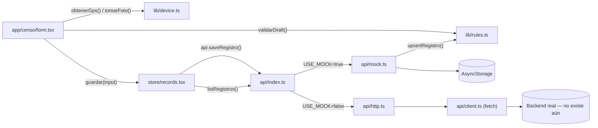

# 🏗️ Cómo está Pensado

## Patrón arquitectónico

**Capas por responsabilidad, con un puerto/adaptador (Ports & Adapters) en el borde de datos.**

No es Clean Architecture "de libro" ni MVC clásico. Es más simple: cuatro capas horizontales
(`app/` → `store/` → `lib/` → `api/`) más un punto único de inversión de dependencia en
`src/api/index.ts`, que decide en tiempo de ejecución si `api` es la implementación mock o la HTTP.

**Por qué esta forma y no otra:**

- El backend real **no existe todavía**. El proyecto necesita poder desarrollarse y probarse por
  completo sin él, y el día que exista, el swap debe ser "cambiar una variable de entorno", no
  "reescribir pantallas". Eso exige que el contrato de datos (`CensoApi`) esté completamente
  desacoplado de quien lo consume.
- El dominio (censo, FROG, CEDIS, status) tiene **reglas de negocio no triviales** (§5, §6, §8,
  §9, §10, §12 del spec) que deben poder verificarse sin levantar la app ni un simulador. Por eso
  viven en `src/lib/rules.ts` como funciones puras, testeables con Node puro (`npm run check`).
- Es el port 1:1 de una demo HTML/CSS/JS. La demo ya separaba `data.js` (datos), `shared.js`
  (estado/reglas) y `styles.css` (visual); esa separación se preservó y se formalizó con tipos.

## Capas / módulos principales

```
app/     → UI y navegación (expo-router). Cablea eventos de usuario a store/ y lib/.
store/   → Estado de React vía Context. Sabe "qué hay que mostrar", no "de dónde sale".
lib/     → Reglas de negocio puras + acceso a hardware (GPS/cámara) + export + formato.
api/     → El único borde que sabe si los datos vienen de AsyncStorage o de un servidor HTTP.
```

| Capa | Responsabilidad | NO hace |
|---|---|---|
| `app/` | Renderizar pantallas, leer input del usuario, invocar `store/` y `api.*` | `fetch` directo, contener reglas de negocio, saber si hay mock |
| `store/` | Mantener estado compartido entre pantallas (sesión, draft, registros, catálogos, resumen) vía Context | Reglas de negocio complejas (delega a `lib/rules.ts`), acceso a hardware |
| `lib/` | Reglas de negocio puras (`rules.ts`), hardware resiliente (`device.ts`), export, formato | Conocer React, conocer si el backend es mock o real |
| `api/` | Definir el contrato (`contract.ts`), implementarlo dos veces (`mock.ts`, `http.ts`) y elegir cuál usar (`index.ts`) | UI, navegación |

## Flujo de una operación típica: guardar un censo

Paso a paso desde que el usuario toca "Guardar censo" en `app/censo/form.tsx` hasta que queda
persistido:

1. **`app/censo/form.tsx` → `onGuardar()`** valida con `validarDraft()` de `src/lib/rules.ts`
   (regla §12.1: estado del enfriador obligatorio). Si falla, `Alert.alert` y corta ahí — nunca
   llega a `api`.
2. Si no hay GPS capturado, se llama `obtenerGps()` de `src/lib/device.ts` (regla §12.3: sello
   automático).
3. Las fotos no simuladas se suben una por una con `api.subirFoto(uri, tipo)`.
4. Se llama `guardar(input)` de `useRecords()` (`src/store/records.tsx`), que a su vez llama
   `api.saveRegistro(input)`.
5. **`src/api/index.ts`** decide si esa llamada va a `mockApi` (`src/api/mock.ts`) o a `httpApi`
   (`src/api/http.ts`) según `EXPO_PUBLIC_USE_MOCK`.
6. En el mock: `saveRegistro` marca `censado: 'SI'` (regla §8), llama a `upsertRegistro()` de
   `src/lib/rules.ts` (reemplaza por `numeroSerie`, nunca duplica) y persiste el arreglo completo
   en `AsyncStorage`.
7. `useRecords().guardar()` vuelve a llamar `refrescar()`, que hace `api.listRegistros()` y
   actualiza el estado de React — así Historial/Dashboard ven el dato nuevo sin recargar la app.
8. `form.tsx` guarda el registro devuelto en el draft (`setUltimo`), limpia el draft (`limpiar()`)
   y navega con `router.replace('/censo/done')`.
9. `app/censo/done.tsx` lee `ultimo` de `useDraft()` y muestra la confirmación con
   `Censado = SI`.

## Diagrama de componentes



## Decisiones técnicas documentadas

- **Context API en vez de Redux/Zustand.** El estado global es chico (sesión, draft de un censo,
  lista de registros, catálogos, resumen) y de vida corta. Una librería externa añadiría
  boilerplate sin beneficio medible. Trade-off aceptado: sin selectors ni memoización fina, cada
  `Provider` re-renderiza sus consumidores enteros — aceptable a esta escala.
- **Sin librería de componentes UI.** La demo HTML define un lenguaje visual propio
  (`styles.css`); replicarlo con `StyleSheet` + un archivo `src/ui/index.tsx` evita traer una
  dependencia pesada (NativeBase/Tamagui/RN Paper) para 15 componentes simples.
- **`src/lib/rules.ts` es 100% función pura**, sin imports de React ni Expo. Esto permite
  ejecutarlo con Node puro vía `node --experimental-strip-types` (`npm run check`), sin levantar
  Jest ni un simulador — feedback de reglas de negocio en menos de un segundo.
- **`src/lib/device.ts` nunca lanza.** Cualquier fallo de permiso de cámara/GPS cae a un valor
  simulado marcado `mock: true`. Decisión explícita: un inspector en campo con permisos mal
  configurados o en un emulador sin GPS **no debe quedar bloqueado** para completar el censo.
- **AsyncStorage como "backend" temporal del mock**, no solo estado en memoria: así Historial y
  Dashboard sobreviven a un reinicio de la app durante el desarrollo, simulando persistencia real.
- **Interruptor único en `src/api/index.ts`** en vez de inyección de dependencias más elaborada
  (contexto de API, DI container): con una sola variable de entorno (`EXPO_PUBLIC_USE_MOCK`) y un
  named export (`api`) alcanza — cualquier cosa más sería sobre-ingeniería para dos
  implementaciones.
- **Mapeo de forma de datos vive en `http.ts`, nunca en pantallas.** Si el backend real responde
  con otros nombres de campo o un envoltorio `{ data: … }`, la corrección se hace ahí, para que
  `app/**/*.tsx` jamás tenga que saber sobre el formato de transporte.
- **App fija en modo claro** (`src/theme.ts`): la demo original no tenía modo oscuro; agregarlo
  no estaba en el alcance del port.
