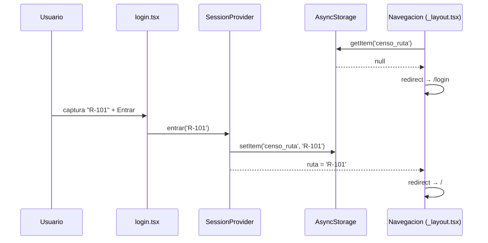
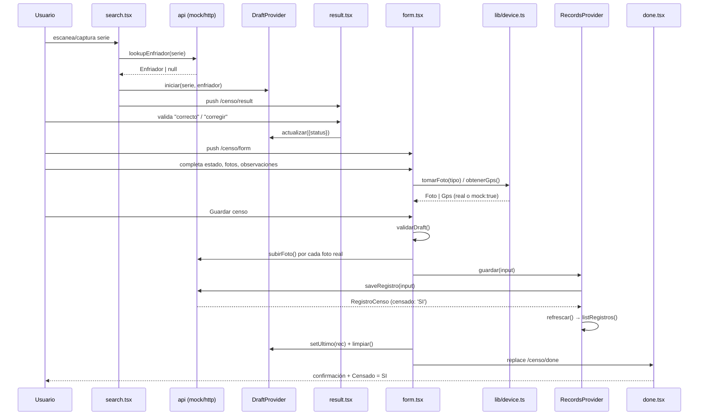
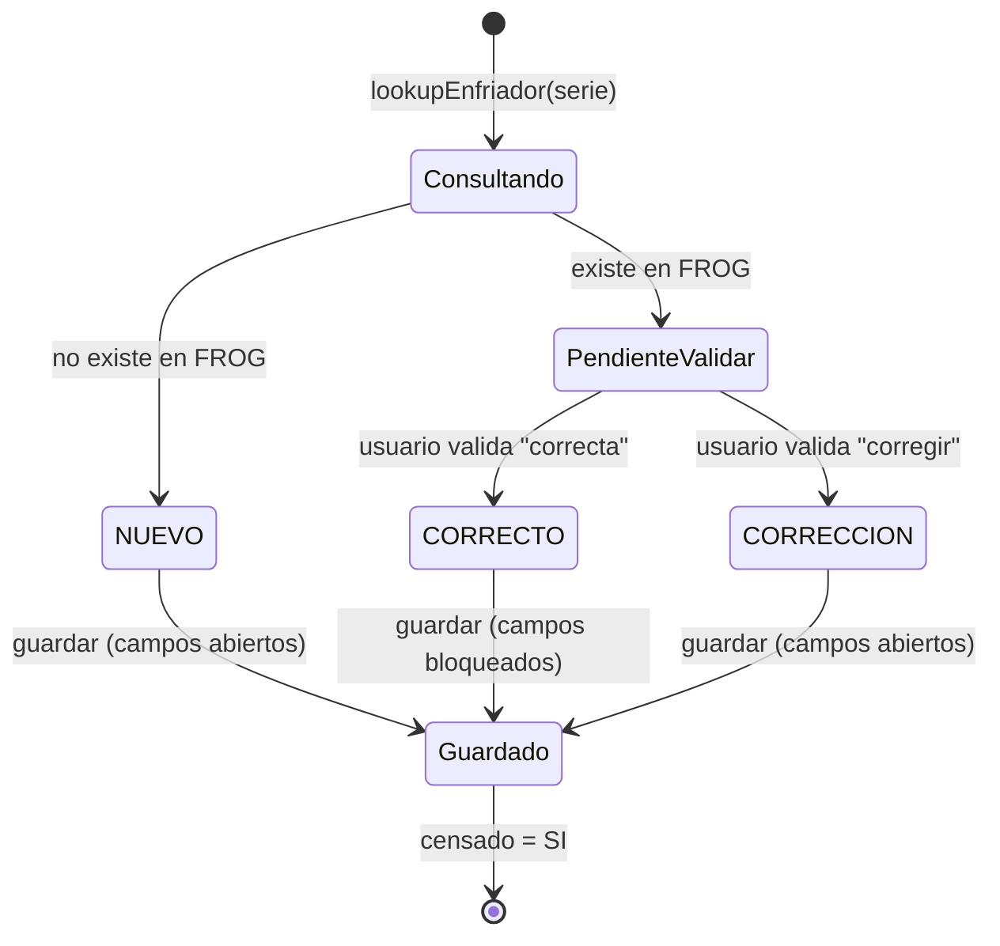
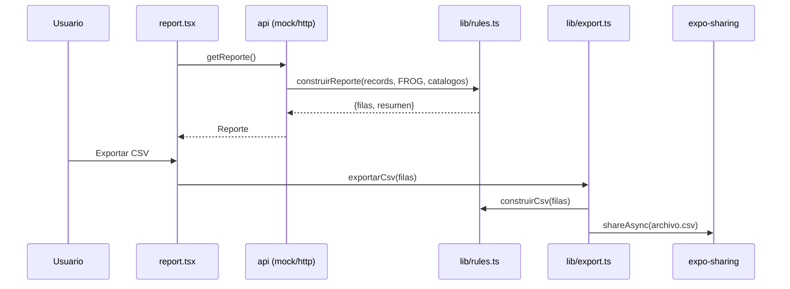

# 🔀 La Lógica en Movimiento

Tres flujos de negocio principales: **sesión/login**, **censar un equipo** (el corazón de la app) y
**reporte corporativo**.

---

## Flujo 1 — Sesión (login sin contraseña)

### Descripción

La ruta del inspector hace las veces de identidad. No hay contraseña ni backend de auth: capturar
una ruta y guardarla localmente basta para "entrar". Existe para que un inspector en campo no
pierda tiempo con credenciales — es una decisión de producto explícita (ver
`CLAUDE.md` § *Fuera de alcance por ahora*).

### Actores

- Usuario (inspector de campo).
- `AsyncStorage` (persistencia local de la ruta).

### Paso a paso técnico

1. `app/_layout.tsx` monta `SessionProvider` (`src/store/session.tsx`), que al arrancar lee
   `censo_ruta` de `AsyncStorage` (`cargando: true` mientras tanto, para no parpadear el login).
2. `Navegacion()` dentro de `_layout.tsx` compara `ruta` contra el segmento de ruta actual: sin
   `ruta` y no estás en `/login` → `router.replace('/login')`. Con `ruta` y estás en `/login` →
   `router.replace('/')`.
3. `app/login.tsx` captura el texto, valida que no esté vacío (`Alert.alert` si lo está) y llama
   `entrar(ruta)`.
4. `entrar()` normaliza (`trim().toUpperCase()`), persiste en `AsyncStorage` y actualiza el
   estado — lo que dispara el `useEffect` de `Navegacion()` y redirige a `/`.
5. `salir()` (botón "Cambiar ruta" en Home) borra la clave y vuelve a `/login`.

### Diagrama de secuencia

### Edge cases

- Ruta vacía → `Alert.alert('Falta la ruta', …)`, no se guarda nada.
- `cargando = true` durante la lectura inicial de `AsyncStorage` → se muestra `<Loading>` en vez
  de parpadear entre login y home.
- `usuario` derivado de la ruta (`inspector.${ruta.toLowerCase()}`) es el que se graba en cada
  registro censado (§12.3) — no hay concepto de usuario separado de la ruta.

### Estados

`cargando` → (`sin ruta` ⇄ `con ruta`). No hay más estados; es binario.

---

## Flujo 2 — Censar un equipo (search → result → form → done)

### Descripción

El flujo central de la app. Cubre las reglas §4, §5, §6, §7, §12.1, §12.2, §12.3 y §8 del spec.
Existe para levantar en campo, con evidencia verificable (foto + GPS), el estado real de cada
enfriador y decidir si su registro en FROG es correcto, necesita corrección, o es un equipo nuevo.

### Actores

- Usuario (inspector).
- FROG (base corporativa, vía `api.lookupEnfriador`) — simulada en `src/api/mock.ts`.
- Hardware del teléfono: cámara (`expo-camera`, `expo-image-picker`) y GPS (`expo-location`).

### Paso a paso técnico

**1. Búsqueda — `app/(tabs)/search.tsx`**
- Escaneo real con `CameraView` (`expo-camera`) o captura manual del número de serie.
- `consultar()` llama `api.lookupEnfriador(serie)`.
- `iniciar(serie, enfriador)` de `useDraft()` (`src/store/draft.tsx`) crea el `Draft`:
  si `enfriador` es `null` → `status: 'NUEVO'`, `esNuevo: true` (regla §5, ya resuelta aquí).
  Si existe → `status: null` (pendiente de validar).
- `router.push('/censo/result')`.

**2. Resultado — `app/censo/result.tsx`**
- Si `esNuevo`, se explica que todos los campos quedan abiertos y se puede continuar directo.
- Si no, un `Segmented` pide "¿la información es correcta?" → `ok` / `fix`.
- Cada elección llama `resolverStatus(true, v)` de `src/lib/rules.ts` (regla §5) y actualiza
  `draft.status` a `'CORRECTO'` o `'CORRECCIÓN'`.
- Botón "Continuar" habilitado solo cuando hay status resuelto (`listo`).

**3. Formulario — `app/censo/form.tsx`** (el corazón)
- `camposEditables(draft.status)` (regla §6): `CORRECTO` bloquea los campos de FROG;
  `CORRECCIÓN`/`NUEVO` los abren.
- Selector de "Estado del enfriador" (regla §12.1, siempre habilitado, obligatorio). Al elegir
  `'En Piso'`, `cambiarEstado()` llama `aplicarEnPiso()` (regla §12.2): fuerza
  `numeroCliente`/`nombreCliente` a `'BODEGA'` y los bloquea, guardando el cliente previo en
  `previoCliente` para poder restaurarlo si el usuario cambia de estado otra vez.
- Evidencia fotográfica: `capturarFoto(tipo)` llama `tomarFoto()` de `src/lib/device.ts` (regla
  §7 — 3 tipos: Frontal, Placa, Fachada). Tocar una foto ya tomada la quita.
- GPS: botón opcional "Obtener ubicación" (`obtenerGps()`); si el usuario no lo toca, se obtiene
  automáticamente al guardar (regla §12.3).
- `onGuardar()`:
  1. `validarDraft()` (regla §12.1) — si falla, `Alert.alert` y no continúa.
  2. Resuelve GPS si falta.
  3. Sube fotos no simuladas con `api.subirFoto()`.
  4. Llama `guardar(input)` de `useRecords()` → `api.saveRegistro()` (regla §8: upsert por serie,
     `censado: 'SI'`).
  5. Guarda el registro en `ultimo` (`setUltimo`), limpia el draft, navega a `/censo/done`.

**4. Confirmación — `app/censo/done.tsx`**
- Si no hay `ultimo` (p. ej. entrada directa sin pasar por el flujo), redirige a `/`.
- Muestra serie, status, estado, cliente, GPS, cantidad de fotos y `Censado = SI`.
- Botones para censar otro equipo o ir a Historial.

### Diagrama de secuencia

### Edge cases y errores

| Caso | Manejo |
|---|---|
| Serie vacía en búsqueda | `Alert.alert('Falta la serie', …)`, no consulta |
| Error de red en `lookupEnfriador` | `Alert.alert('Error de consulta', mensaje)` |
| Entrar a `/censo/result` sin draft (hot reload, deep link) | `<Redirect href="/search" />` |
| Entrar a `/censo/form` sin draft | `<Redirect href="/search" />` |
| Entrar a `/censo/done` sin `ultimo` | `<Redirect href="/" />` |
| Sin permiso de cámara | `abrirEscaner()` pide permiso; si se niega, `Alert.alert` sugiere captura manual |
| Sin permiso de cámara al tomar evidencia / sin GPS | `src/lib/device.ts` nunca lanza: devuelve foto/GPS simulados (`mock: true`) |
| Guardar sin estado del enfriador | `validarDraft()` bloquea con mensaje, no llega a `api` |
| Reentrar a "En Piso" dos veces seguidas | El respaldo de cliente no se sobrescribe con `BODEGA` (cubierto en `rules.check.ts`) |
| Guardar la misma serie dos veces | `upsertRegistro()` reemplaza, nunca duplica (regla §8) |

### Estados posibles (status del registro)

---

## Flujo 3 — Reporte corporativo y exportación

### Descripción

Vista consolidada del universo completo: equipos ya censados **más** los que siguen en FROG sin
censar (`Censado = NO`). Existe para que el negocio pueda medir avance real del proyecto de censo,
no solo lo capturado. Exportable a Excel (CSV) y PDF para compartir fuera de la app.

### Actores

- Usuario (cualquier inspector, o quien revise el avance).
- `api.getReporte()` — reconstruye desde `listRegistros()` + FROG en el mock; en el backend real
  puede ser un endpoint dedicado o construirse igual del lado del servidor.
- `expo-print` / `expo-sharing` / `expo-file-system` para exportar.

### Paso a paso técnico

1. `app/report.tsx` pide el reporte en cada `useFocusEffect` con `api.getReporte()`.
2. El mock delega en `construirReporte()` de `src/lib/rules.ts` (regla §10): toma `FROG` menos
   las series ya censadas → filas `Censado = NO`; concatena las filas censadas (con su `status`,
   `estadoEnfriador`, etc.); ordena por CEDIS, luego pendientes al final, luego fecha descendente.
3. La pantalla muestra KPIs (`StatRow`), distribuciones (`DistBars` por estado/CEDIS/tipo/marca) y
   una tabla horizontal con `COLUMNAS_REPORTE` (14 columnas fijas).
4. Exportar CSV: `exportarCsv(filas)` en `src/lib/export.ts` usa `construirCsv()` (con BOM UTF-8
   para que Excel respete acentos) y comparte el archivo con `expo-sharing`.
5. Exportar PDF: `exportarPdf(reporte, usuario)` genera HTML propio (tabla + KPIs) y lo imprime a
   archivo con `expo-print`, luego lo comparte.

### Diagrama de secuencia

### Edge cases y errores

- `getReporte()` falla → `<Empty>{mensaje}</Empty>`, sin romper la pantalla.
- Dispositivo sin capacidad de compartir → `exportarCsv`/`exportarPdf` lanzan
  `'Este dispositivo no permite compartir archivos.'`, capturado y mostrado con `Alert.alert`.
- Observaciones con comillas dobles → `construirCsv()` las escapa (`""`) para no romper el CSV.
- Reporte vacío (sin FROG ni registros) → tabla con solo encabezado, `DistBars` muestra "Sin
  datos." en cada distribución.

### Estados

No hay máquina de estados propia; es lectura + exportación. El único estado relevante es
`exportando: 'csv' | 'pdf' | null`, que deshabilita ambos botones mientras uno exporta.
