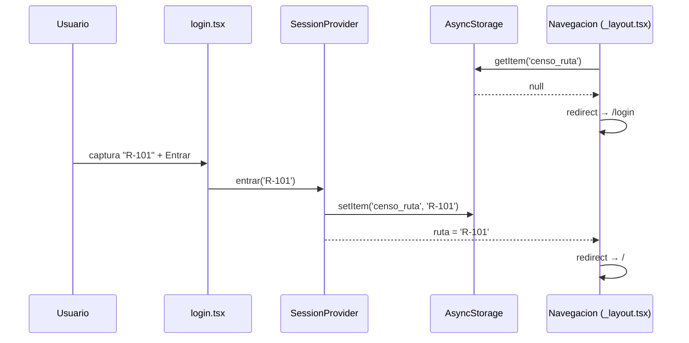
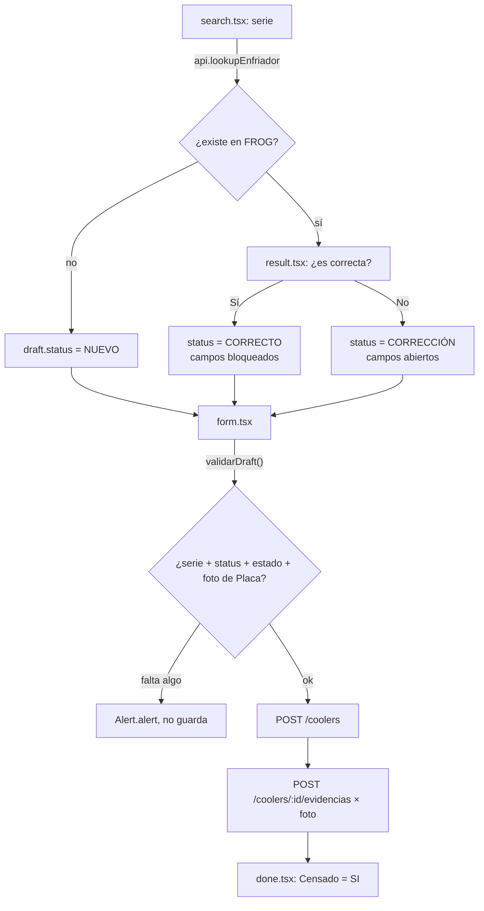
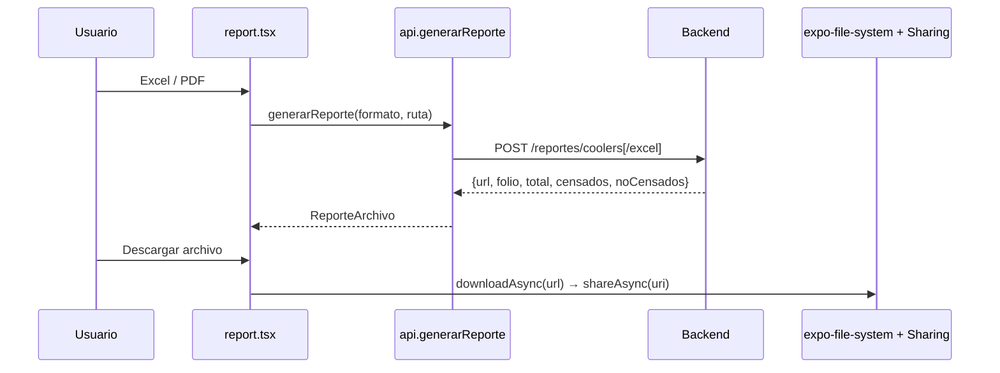
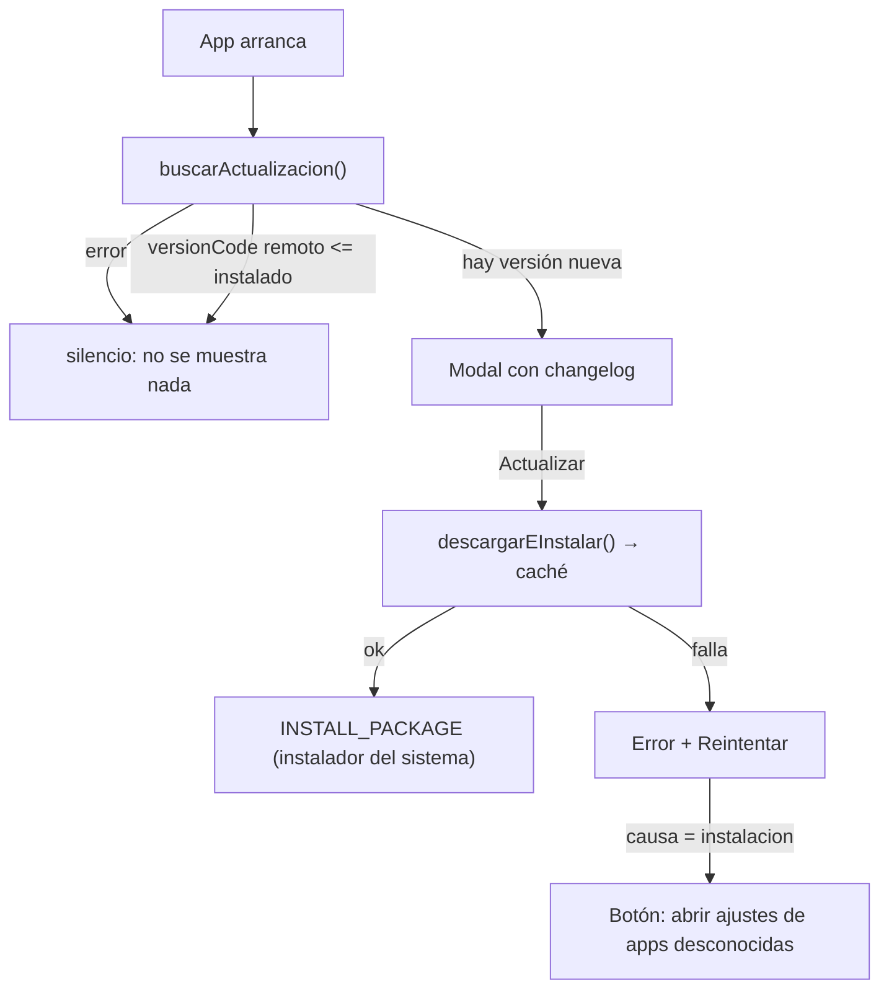

# 🔀 La Lógica en Movimiento

Cuatro flujos: **sesión/login**, **censar un equipo** (el corazón de la app), **reporte
corporativo** y **auto-actualización del APK**.

---

## Flujo 1 — Sesión (login sin contraseña)

### Descripción

La ruta del inspector hace las veces de identidad. No hay contraseña ni backend de auth: capturar
una ruta y guardarla localmente basta para "entrar". Decisión de producto explícita (ver
`CLAUDE.md` § *Fuera de alcance por ahora*).

La ruta no es solo cosmética: **acota casi todo lo que la app consulta** — `listCoolers({ruta})`,
`listFrog(ruta)`, `listFaltantes(ruta)`, `getResumen(ruta)` y `generarReporte(formato, ruta)`.

### Paso a paso técnico

1. `app/_layout.tsx` monta `SessionProvider` (`src/store/session.tsx`), que al arrancar lee
   `censo_ruta` de `AsyncStorage` (`cargando: true` mientras tanto, para no parpadear el login).
2. `Navegacion()` compara `ruta` contra el segmento actual: sin `ruta` y fuera de `/login` →
   `router.replace('/login')`. Con `ruta` y dentro de `/login` → `router.replace('/')`.
3. `app/login.tsx` captura el texto, valida que no esté vacío (`Alert.alert` si lo está) y llama
   `entrar(ruta)`.
4. `entrar()` normaliza (`trim().toUpperCase()`), persiste y actualiza el estado — lo que dispara
   el `useEffect` de `Navegacion()`.
5. `usuario` se deriva de la ruta: `inspector.${ruta.toLowerCase()}`. Es lo que se graba en el
   registro (§12.3).
6. `salir()` (botón "Cambiar ruta" en Home) borra la clave y vuelve a `/login`.

### Edge cases

- Los chips de rutas sugeridas en el login solo aparecen si `catalogos.rutas` trae algo. Contra el
  backend real **no aparecen**: `getCatalogos()` de `http.ts` devuelve `rutas: []` porque
  `/catalogos` no existe todavía.
- No hay validación de formato de ruta: cualquier texto no vacío entra.

---

## Flujo 2 — Censar un equipo (search → result → form → done)

### Paso a paso técnico

1. **`app/(tabs)/search.tsx`** — el inspector escanea con `CameraView` (`expo-camera`, tipos
   `code128`, `code39`, `ean13`, `ean8`, `upc_a`, `qr`) o teclea la serie. Sin permiso de cámara
   ofrece captura manual (y "Simular escaneo" solo con `USE_MOCK`).
2. `api.lookupEnfriador(serie)` → `GET /frog/enfriadores/:serie`. Devuelve un **array**; se toma la
   primera fila (§4). Array vacío o `404` ⇒ `null` ⇒ el censo nace `NUEVO` (§5).
3. `iniciar(serie, enfriador)` de `useDraft()` crea el draft en memoria. Si `enfriador` es `null`,
   el `status` ya queda decidido como `'NUEVO'` y `esNuevo: true`.
4. **`app/censo/result.tsx`** — muestra lo que devolvió FROG. Si existía, pide la validación
   (`Segmented`: "Sí, correcta" / "No, corregir") y llama `resolverStatus(true, v)` →
   `CORRECTO` / `CORRECCIÓN` (§5). Si era nuevo, no pregunta nada.
5. **`app/censo/form.tsx`** — `camposEditables(status)` decide si los datos de FROG están
   bloqueados (§6: solo `CORRECTO` bloquea). El estado del enfriador siempre está habilitado
   (§12.1).
6. Elegir **"En Piso"** dispara `aplicarEnPiso()`: fuerza `numeroCliente` y `nombreCliente` a
   `BODEGA` y los bloquea; volver a otro estado restaura el cliente previo (§12.2).
7. Fotos: `tomarFoto(tipo)` por cada uno de `Frontal | Placa | Fachada`. Tocar una foto ya tomada
   la **quita** (segundo toque = borrar y volver a capturar).
8. GPS: botón manual, o automático al guardar (§12.3).
9. Guardar → `validarDraft()` → `api.saveRegistro()` → `setUltimo` → `/censo/done`.

### Validación al guardar — `validarDraft()` (`src/lib/rules.ts`)

En orden, el primer error corta:

| Condición | Mensaje |
|---|---|
| `numeroSerie` vacía | `El número de serie es obligatorio.` |
| `status` sin decidir | `Indica si la información recuperada es correcta.` |
| `estadoEnfriador` vacío | `El estado del enfriador es obligatorio.` |
| Sin foto de tipo `Placa` con `uri` | `La fotografía de la placa es obligatoria.` |

> ⚠️ **La foto de la placa es obligatoria; Frontal y Fachada no.** La placa es la evidencia que
> amarra el censo a la serie. El label del campo lo dice ("Evidencia fotográfica (Placa
> obligatoria)"), pero un censo puede guardarse con **una sola** foto.

### Edge cases y errores

- **Draft perdido** (recarga en caliente, o entrar a `/censo/form` sin pasar por search):
  `<Redirect href="/search" />`. En `done.tsx` sin `ultimo`, redirige a `/`.
- **Serie ya censada**: contra el mock, `upsertRegistro()` reemplaza (§8). Contra el backend real,
  `POST /coolers` responde **409** con un `title` tipo "Cooler con serie 'X' ya existe"; el mensaje
  del servidor se muestra tal cual en el `Alert.alert`. El upsert del §8 lo implementa el servidor,
  no el cliente.
- **Foto simulada** (`mock://…`): la UI dibuja un recuadro de color en vez de la imagen, y
  `saveRegistro` **no intenta subirla** (no hay archivo real detrás).
- **GPS simulado**: se muestra "(simulada)" junto a las coordenadas; el censo se guarda igual.
- **`cedis` / `ruta` vacíos** al guardar: se mandan como `'Sin CEDIS'` y `'—'` respectivamente
  (fallback en `form.tsx:onGuardar`).

---

## Flujo 3 — Reporte corporativo

### Descripción

**El reporte lo genera el backend, no la app.** El servidor cruza FROG contra lo censado y devuelve
la **URL** de un archivo (PDF o Excel), no el binario. El rango del reporte es la ruta del
inspector (`rutaIni = rutaFin = ruta`, con UDN abierta `00–99`).

### Paso a paso técnico

1. `app/report.tsx` → `api.generarReporte('pdf' | 'excel', ruta)` →
   `POST /reportes/coolers` o `POST /reportes/coolers/excel`, body
   `{udnIni:"00", udnFin:"99", rutaIni, rutaFin, folio:null}` (sin `folio` el backend usa la ronda
   de censo vigente).
2. La respuesta es `ReporteArchivo`: `{url, folio, total, censados, noCensados, generado}`. Si está
   configurada `EXPO_PUBLIC_IMG_URL`, se le reapunta el host (mismo Nginx que las fotos).
3. La pantalla ofrece cuatro acciones sobre esa URL:
   - **Abrir** → `Linking.openURL`.
   - **Descargar archivo** → `downloadAsync` a la caché + `Sharing.shareAsync` con el MIME correcto
     (comparte el archivo real, no el enlace).
   - **Compartir** → `Share.share({message: url})` (comparte el enlace).
   - **QR** → `react-native-qrcode-svg` con la URL, para escanearla desde una computadora.

### Edge cases y errores

- **409** = no hay ronda de censo abierta; **502** = FROG falló. El mensaje del backend se muestra
  tal cual en `Alert.alert('No se pudo generar', …)`.
- **Sin ruta en sesión** los dos botones quedan deshabilitados (`disabled={… || !ruta}`).
- **El enlace caduca**: la pantalla avisa "deja de servir a los 14 días".
  `[TODO: los 14 días son de `REPORTES_RETENCION_DIAS` del backend; confirmar que sigue en 14 —
  el texto está hardcodeado en `app/report.tsx`.]`
- **Dispositivo sin share sheet** → `Alert.alert('Descargado', uri)` con la ruta local.

### Lo que quedó del reporte viejo

`getReporte()`, `construirReporte()`, `construirCsv()` y `COLUMNAS_REPORTE` siguen existiendo y
funcionando, pero **ninguna pantalla los llama**: `report.tsx` migró al reporte del servidor. Hoy
los consumen solo `mock.ts` (para su propio `getReporte`) y `rules.check.ts`. Ver
[05-API.md](05-API.md) § *Métodos del contrato que ninguna pantalla usa*.

---

## Flujo 4 — Auto-actualización del APK

### Descripción

La app se reparte fuera de Play Store, así que se actualiza contra un Nginx propio
(`EXPO_PUBLIC_UPDATE_URL`, default `https://files.censo.aaocsa.com/app-release`).

### Paso a paso técnico

1. `<ModalActualizacion>` (montado una vez en `app/_layout.tsx`) llama `buscarActualizacion()` al
   arrancar. **Falla en silencio**: si el servidor de updates está caído, el inspector tiene que
   poder censar igual.
2. `buscarActualizacion()` hace `fetch` de `{UPDATE_URL}/version.json` con `Cache-Control: no-cache`
   y timeout de 10 s, y pasa el JSON por `normalizarVersion()` (`src/lib/version.ts`), que valida
   `versionCode` entero > 0 y `apkUrl` no vacía. Cualquier otra cosa ⇒ `UpdateError`.
3. Compara contra `Application.nativeBuildVersion` — es decir, contra el **`versionCode`**, no el
   `versionName`. Si no es mayor, devuelve `null` y el modal no se monta.
4. Al aceptar: `descargarEInstalar()` baja el APK a la caché con progreso (`idempotent: true` para
   que un reintento pise una descarga a medias), verifica que no llegó vacío, obtiene un `content://`
   con `getContentUriAsync` y lanza `INSTALL_PACKAGE` vía `expo-intent-launcher`.
5. Con `forceUpdate: true` el modal no se puede cerrar: sin botón "Después" y con `onRequestClose`
   neutralizado para que el botón atrás de Android no lo esquive.

### Edge cases y errores

- **La promesa resuelve al lanzar el instalador, no al terminar la instalación.** Si el usuario
  cancela, la app sigue viva y vuelve al aviso. No hay forma de distinguir "canceló" de "instaló"
  sin salir de la app — y no hace falta: al reabrir, el `versionCode` ya coincide.
- **Permiso "instalar apps desconocidas"**: no se consulta antes (no hay API de Expo para
  `canRequestPackageInstalls()`). Lo pide el instalador; si el intent falla, el modal ofrece el
  botón que abre esos ajustes.
- **Fuera de Android**, `buscarActualizacion()` devuelve `null` de entrada.
- **Descarga interrumpida**: se borra el archivo parcial y se lanza
  `UpdateError('La descarga se interrumpió…', 'descarga')`.

Cómo publicar una versión nueva: [11-BUILD-Y-ACTUALIZACIONES.md](11-BUILD-Y-ACTUALIZACIONES.md).

---

## Flujo transversal — Historial en tres modos

`app/(tabs)/history.tsx` no es un flujo de negocio propio, pero sí la pantalla con más estado:

| Modo | Fuente | Pagina | Fila |
|---|---|---|---|
| **Censados** | `api.listCoolers({page, pageSize:20, serie, ruta})` | Sí (20 por página) | `Cooler` |
| **En FROG** | `api.listFrog(ruta)` — el padrón completo de la ruta | No | `FrogRow` |
| **Faltantes** | `api.listFaltantes(ruta)` — padrón menos censados (§10) | No | `FrogRow` |

- El modo llega por query string desde las tarjetas de Home: `/history?modo=frog`.
- El filtro por serie solo aplica al modo Censados (es el único paginado del servidor).
- Se recarga al enfocar la pantalla (`useFocusEffect` + un `tick` que fuerza el efecto), así el
  listado refleja un censo recién guardado.
- Tocar una fila abre un modal de detalle: todos los campos + las evidencias con su imagen (solo
  los censados tienen fotos).
- `esCooler(f)` distingue las dos formas por la presencia de `id`.
