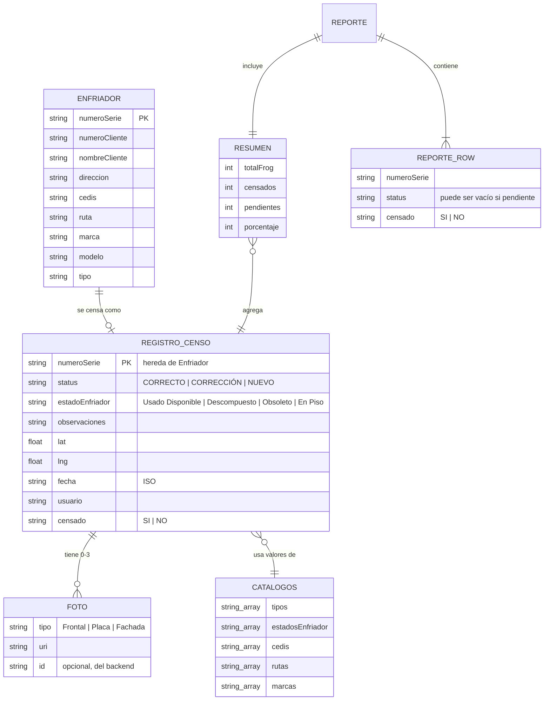

# 🗃️ El Modelo de Datos

No hay base de datos relacional ni ORM: el "esquema maestro" son las interfaces TypeScript de
`src/api/types.ts`. La persistencia real hoy es `AsyncStorage` (clave-valor) en el mock; el backend
real (no implementado) decidirá su propio motor, pero debe respetar estos tipos como contrato.

## Diagrama entidad-relación (conceptual)

## Entidades

### `Enfriador` (`src/api/types.ts:12`)

Lo que devuelve FROG al consultar una serie (§4). Llave: `numeroSerie`.

| Campo | Tipo | Notas |
|---|---|---|
| `numeroSerie` | `string` | Llave única, siempre en mayúsculas (normalizada en `lookupEnfriador`) |
| `numeroCliente` | `string` | Se fuerza a `'BODEGA'` si el estado es "En Piso" (§12.2) |
| `nombreCliente` | `string` | Ídem |
| `direccion` | `string` | |
| `cedis` | `string` | Debe existir en `Catalogos.cedis` |
| `ruta` | `string` | Debe existir en `Catalogos.rutas` |
| `marca` | `string` | Debe existir en `Catalogos.marcas` |
| `modelo` | `string` | Libre |
| `tipo` | `string` | Debe existir en `Catalogos.tipos` |

### `RegistroCenso` (`src/api/types.ts:36`) extends `Enfriador`

Un censo levantado en campo. Es lo que se persiste. Llave: `numeroSerie` (upsert, regla §8).

| Campo | Tipo | Notas |
|---|---|---|
| `status` | `'CORRECTO' \| 'CORRECCIÓN' \| 'NUEVO'` | Decidido por `resolverStatus()` (§5) |
| `estadoEnfriador` | `EstadoEnfriador` | Obligatorio (§12.1) |
| `observaciones` | `string` | Libre, texto |
| `lat`, `lng` | `number` | GPS del levantamiento (§12.3) |
| `fecha` | `string` (ISO) | Sello automático al guardar |
| `usuario` | `string` | Derivado de la ruta de sesión |
| `censado` | `'SI' \| 'NO'` | Siempre `'SI'` al guardar (§8); `'NO'` solo aparece en filas de reporte para pendientes |
| `fotos` | `Foto[]` | 0 a 3 evidencias |

`RegistroCensoInput = Omit<RegistroCenso, 'censado'>` — lo que la pantalla envía; el servidor
decide `censado`.

### `Draft` (`src/api/types.ts:53`) extends `Enfriador`

El censo **en construcción**, mientras se recorre `search → result → form`. Vive solo en memoria
(`src/store/draft.tsx`), equivalente al `sessionStorage` de la demo — si la app se cierra a media
captura, se pierde (comportamiento igual a la demo original, decisión consciente).

| Campo | Tipo | Notas |
|---|---|---|
| `status` | `Status \| null` | `null` hasta que el usuario valida en Resultado |
| `esNuevo` | `boolean` | `true` cuando la serie no existía en FROG |
| `estadoEnfriador` | `EstadoEnfriador \| ''` | Vacío hasta elegirlo en el formulario |
| `gps` | `Gps \| null` | `null` hasta capturarlo (o hasta guardar, que lo resuelve automático) |

### `Foto` (`src/api/types.ts:27`)

| Campo | Tipo | Notas |
|---|---|---|
| `tipo` | `'Frontal' \| 'Placa' \| 'Fachada'` | Las 3 evidencias obligatorias del spec (§7); no obligatorio a nivel de tipo, pero sí de producto |
| `uri` | `string` | URI local (`mock://…` si simulada) o remota tras `subirFoto()` |
| `id` | `string?` | Vacío hasta que el backend confirma la subida |

### `Catalogos` (`src/api/types.ts:113`)

Listas cerradas usadas por selects en toda la app. Hoy constantes (`CATALOGOS` en
`src/api/mock.ts`), mañana un endpoint (`GET /catalogos`, ya implementado en `http.ts`).

### `Resumen` (`src/api/types.ts:72`)

Agregados del Dashboard (§9): `totalFrog`, `censados`, `pendientes`, `porcentaje` y distribuciones
(`porStatus`, `porEstado`, `porCedis`, `porTipo`, `porMarcaModelo`) — todas `Distribucion[]`
(`{etiqueta, total}`). Se calcula 100% en `construirResumen()` (`src/lib/rules.ts`), nunca en la UI.

### `Reporte` (`src/api/types.ts:107`)

`{ filas: ReporteRow[], resumen: Resumen }`. Universo completo (§10): registros censados +
pendientes de FROG marcados `Censado = NO`. Ver `ReporteRow` para las 14 columnas exportadas
(`COLUMNAS_REPORTE` en `rules.ts`).

## Migraciones

No aplica: no hay base de datos con esquema versionado. El "esquema" son los tipos TS; un cambio de
campo se propaga por el compilador (`tsc --noEmit` falla en cualquier lugar desincronizado). Ver
`CLAUDE.md` § *Agregar un campo al registro* para el procedimiento manual.

## Fuente de verdad del esquema

`src/api/types.ts`. Cualquier otra representación (JSON del mock, respuesta HTTP esperada,
columnas del reporte) debe ser consistente con estos tipos.

## Persistencia real (mock)

- **Motor**: `@react-native-async-storage/async-storage` — almacenamiento clave-valor local del
  dispositivo.
- **Clave usada**: `censo_registros_v1` (array JSON de `RegistroCenso[]`), y `censo_ruta` (string,
  para la sesión).
- **Lectura** (`leer()` en `src/api/mock.ts:95`): si no existe la clave, siembra con `SEED` y la
  persiste; si existe, deserializa.
- **Escritura** (`escribir()`): serializa el arreglo completo y lo reemplaza — no hay updates
  parciales ni índices, es un documento único por clave.

## Datos de seed / fixtures

- **`FROG`** (`src/api/mock.ts:34`) — 6 enfriadores simulados que representan la base corporativa.
  `SERIES_DEMO` expone sus números de serie para pruebas rápidas en la UI.
- **`SEED`** (`src/api/mock.ts:71`) — 3 registros censados de ejemplo (uno `CORRECTO`, uno
  `CORRECCIÓN`, uno `NUEVO` con "En Piso"/`BODEGA`) para que Historial y Dashboard no arranquen
  vacíos.
- **`CATALOGOS`** (`src/api/mock.ts:25`) — tipos (`AAOCSA`, `PEÑAFIEL`, `BONAFONT`), estados,
  CEDIS (Norte/Sur/Centro), rutas (`R-101`…`R-310`) y marcas.
- **Reset**: `resetDemo()` borra la clave de `AsyncStorage`; la próxima lectura vuelve a sembrar
  `SEED`. Expuesto en Historial como botón "Limpiar" (solo visible con `USE_MOCK`).
