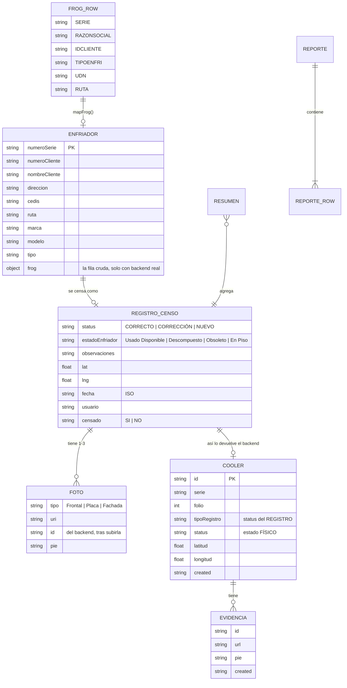

# 🗃️ El Modelo de Datos

No hay base de datos relacional ni ORM en la app: el "esquema maestro" son las interfaces
TypeScript de `src/api/types.ts`. La persistencia local es `AsyncStorage` (clave-valor) en el mock;
con backend real, todo vive en el servidor y la app no guarda censos localmente.

`types.ts` tiene **dos familias de tipos** y conviene no mezclarlas:

| Familia | Ejemplos | Nombres |
|---|---|---|
| **Dominio** — lo que consumen las pantallas | `Enfriador`, `RegistroCenso`, `Draft`, `Resumen` | español, camelCase (`numeroSerie`) |
| **Crudos del backend** — lo que viaja por HTTP | `FrogRow`, `Cooler`, `Evidencia`, `CoolersPage` | los del servidor (`RAZONSOCIAL`, `tipoRegistro`) |

`src/api/http.ts` es el único lugar que traduce entre las dos.

## Diagrama entidad-relación (conceptual)

## Entidades del dominio

### `Enfriador` (`src/api/types.ts:48`)

Lo que devuelve FROG al consultar una serie (§4). Llave: `numeroSerie`.

| Campo | Tipo | Notas |
|---|---|---|
| `numeroSerie` | `string` | Llave única, siempre en mayúsculas (normalizada en `lookupEnfriador`) |
| `numeroCliente` | `string` | Se fuerza a `'BODEGA'` si el estado es "En Piso" (§12.2) |
| `nombreCliente` | `string` | Ídem |
| `direccion` | `string` | Con backend real se arma como `CALLE NUMERO, COLONIA` |
| `cedis` | `string` | Viene de `UDN` |
| `ruta` | `string` | |
| `marca`, `modelo` | `string` | |
| `tipo` | `string` | Normalizado contra `TIPOS_ENFRIADOR` sin acentos ni espacios |
| `frog?` | `FrogRow` | **Solo con backend real.** La fila original, para devolverla intacta en el POST |

### `RegistroCenso` (`src/api/types.ts:76`) extends `Enfriador`

Un censo levantado en campo. Llave: `numeroSerie` (upsert, §8).

| Campo | Tipo | Notas |
|---|---|---|
| `status` | `'CORRECTO' \| 'CORRECCIÓN' \| 'NUEVO'` | Decidido por `resolverStatus()` (§5) |
| `estadoEnfriador` | `EstadoEnfriador` | Obligatorio (§12.1) |
| `observaciones` | `string` | Libre |
| `lat`, `lng` | `number` | GPS del levantamiento (§12.3) |
| `fecha` | `string` (ISO) | La pone el cliente al guardar; el backend devuelve su propio `created` |
| `usuario` | `string` | `inspector.<ruta en minúsculas>` |
| `censado` | `'SI' \| 'NO'` | Siempre `'SI'` al guardar (§8) |
| `fotos` | `Foto[]` | 1 a 3 evidencias — la de `Placa` es obligatoria |

`RegistroCensoInput = Omit<RegistroCenso, 'censado'>` — lo que la pantalla envía.

### `Draft` (`src/api/types.ts:93`) extends `Enfriador`

El censo **en construcción** (`search → result → form`). Vive solo en memoria
(`src/store/draft.tsx`): si la app se cierra a media captura, se pierde.

| Campo | Tipo | Notas |
|---|---|---|
| `status` | `Status \| null` | `null` hasta validar en Resultado; ya `'NUEVO'` si no estaba en FROG |
| `esNuevo` | `boolean` | `true` cuando la serie no existía en FROG |
| `estadoEnfriador` | `EstadoEnfriador \| ''` | Vacío hasta elegirlo |
| `gps` | `Gps \| null` | `null` hasta capturarlo (o hasta guardar) |

> El formulario mantiene `estado`, `observaciones`, `fotos` y `gps` en **estado local de React**,
> no en el draft; solo los datos del cliente/equipo se escriben al draft con `actualizar()`. Al
> guardar se combinan. Consecuencia: navegar hacia atrás desde el formulario pierde fotos y
> observaciones aunque el draft siga vivo.

### `Foto` (`src/api/types.ts:65`)

| Campo | Tipo | Notas |
|---|---|---|
| `tipo` | `'Frontal' \| 'Placa' \| 'Fachada'` | Las 3 evidencias del spec (§7); solo `Placa` bloquea el guardado |
| `uri` | `string` | URI local (`mock://…` si simulada) o URL remota tras subirla |
| `id?` | `string` | Lo devuelve el backend al subirla |
| `pie?` | `string` | Pie de la evidencia; sin valor se manda el `tipo` |

### `Gps` (`src/api/types.ts:104`)

`{lat, lng, mock}` — `mock: true` marca coordenadas simuladas (sin permiso / emulador).

### `Resumen` (`src/api/types.ts:112`)

Indicadores del Dashboard (§9): `totalFrog`, `censados`, `pendientes`, `porcentaje`, `folio?`,
`porStatus` (`Record<Status, number>`) y cuatro `Distribucion[]` (`porEstado`, `porCedis`,
`porTipo`, `porMarcaModelo`).

> ⚠️ **Con backend real, `porCedis`, `porTipo` y `porMarcaModelo` llegan siempre vacíos.** El
> backend todavía no agrupa por esas dimensiones (`mapResumen()` en `http.ts` los deja en `[]`).
> Por eso el bloque "Avance por CEDIS" está comentado en `app/(tabs)/dashboard.tsx`.

### `Reporte` / `ReporteRow` (`src/api/types.ts:132`, `:149`)

`{filas, resumen}` — universo completo (§10): censados + pendientes de FROG con `Censado = NO`.
Las 14 columnas exportables están en `COLUMNAS_REPORTE` (`src/lib/rules.ts:170`). Hoy solo los usa
el mock; el reporte real lo genera el servidor (ver [03-FLUJOS.md](03-FLUJOS.md)).

### `ReporteArchivo` (`src/api/types.ts:156`)

Lo que responde `POST /reportes/coolers[/excel]`: `{url, folio, total, censados, noCensados,
generado}`. El archivo se queda en el servidor; la app solo recibe la URL.

### `Catalogos` (`src/api/types.ts:228`)

`{tipos, estadosEnfriador, cedis, rutas, marcas}`. Contra el backend real solo llegan con contenido
`tipos` y `estadosEnfriador` (constantes locales); el resto va vacío hasta que exista `/catalogos`.

## Tipos crudos del backend

### `FrogRow` (`src/api/types.ts:26`)

La fila tal cual la devuelve FROG, **todo en MAYÚSCULAS** y todo opcional/nullable: `COMODATO`,
`CONTRATO`, `UDN`, `RUTA`, `IDCLIENTE`, `RAZONSOCIAL`, `DENCOMERCIAL`, `CALLE`, `NUMERO`,
`COLONIA`, `FREC`, `SERIE`, `DESCRIPCION`, `TIPOENFRI`, `ANIO`, `SUBSTATUS`, `MARCA`, `MODELO`.

Se arrastra sin tocar dentro de `Enfriador.frog` para poder devolverla intacta en el `POST /coolers`:
trae campos (comodato, contrato, frecuencia, año) que el dominio no modela pero el servidor sí
espera.

### `Cooler` (`src/api/types.ts:178`) y `Evidencia` (`:171`)

La vista del censo que devuelve `GET /coolers`: más campos del cliente que `RegistroCenso` y
evidencias con URL remota. Se modela aparte a propósito, en vez de forzar el mapeo a
`RegistroCenso` y perder información.

> ⚠️ **`Cooler.status` NO es el status del registro.** Es el estado **físico** del enfriador
> (`USADO_DISPONIBLE` / `DESCOMPUESTO` / `OBSOLETO` / `EN PISO`). El status del registro (§5) viaja
> en `tipoRegistro` (`CORRECTO` / `CORRECCION` / `NUEVO`, **sin acento**). Confundirlos pinta la UI
> con la paleta equivocada; en Historial el punto de la card usa `tipoRegistro` y la pill usa
> `status`.

### `CoolersPage` / `CoolersQuery` (`:211`, `:218`)

`{items, page, pageSize, totalCount}` y `{page?, pageSize?, serie?, ruta?}`. `serie` es coincidencia
parcial; `ruta` es exacta (es un código).

## Enums y constantes del dominio

| Constante | Valores | Dónde |
|---|---|---|
| `ESTADOS_ENFRIADOR` | `Usado Disponible`, `Descompuesto`, `Obsoleto`, `En Piso` | `types.ts:9` — **el orden importa**: es el índice que empata con las claves del backend |
| `TIPOS_ENFRIADOR` | `AAOCSA`, `PEÑAFI`, `BONAFO`, `DANONE` | `types.ts:19` — las claves que FROG devuelve en `TIPOENFRI` |
| `BODEGA` | `'BODEGA'` | `rules.ts:21` — el cliente forzado por En Piso (§12.2) |

> ⚠️ **El mock usa otros nombres de tipo que el backend**: `CATALOGOS.tipos` de `mock.ts:28` trae
> `AAOCSA`, `PEÑAFIEL`, `BONAFONT` (nombres completos), mientras `TIPOS_ENFRIADOR` trae las claves
> truncadas reales (`PEÑAFI`, `BONAFO`) más `DANONE`. Consecuencia: un `tipo` capturado con el mock
> no empata con el catálogo del backend real. Solo afecta a datos de demo.

### Serialización de enums al backend (`src/api/http.ts`)

| Dominio | Va al backend como | Ojo |
|---|---|---|
| `Usado Disponible` | `USADO_DISPONIBLE` | |
| `Descompuesto` | `DESCOMPUESTO` | |
| `Obsoleto` | `OBSOLETO` | |
| `En Piso` | `EN PISO` | **con espacio, no con guion bajo** |
| `CORRECTO` | `CORRECTO` | |
| `CORRECCIÓN` | `CORRECCION` | **sin acento**; mandarlo con acento responde 400 |
| `NUEVO` | `NUEVO` | |

## Persistencia local

| Clave de AsyncStorage | Contenido | Quién la escribe |
|---|---|---|
| `censo_ruta` | La ruta del inspector (string) | `src/store/session.tsx` |
| `censo_registros_v1` | `RegistroCenso[]` completo (JSON) | `src/api/mock.ts` — **solo en modo mock** |

Escritura: se serializa el arreglo completo y se reemplaza; no hay updates parciales ni índices.
Lectura: si la clave no existe, siembra con `SEED` y la persiste.

## Datos de seed / fixtures (solo mock)

- **`FROG`** (`src/api/mock.ts:37`) — 6 enfriadores simulados. `SERIES_DEMO` expone sus series para
  los chips de prueba de la pantalla de búsqueda.
- **`SEED`** — 3 registros censados de ejemplo (uno `CORRECTO`, uno `CORRECCIÓN`, uno `NUEVO` con
  "En Piso"/`BODEGA`) para que Historial y Dashboard no arranquen vacíos.
- **`CATALOGOS`** (`src/api/mock.ts:28`) — tipos, estados, CEDIS (Norte/Sur/Centro), rutas
  (`R-101`…`R-310`) y marcas.
- **`gpsMock(semilla)`** — coordenadas alrededor de CDMX cuando no hay GPS. La semilla es
  `registros.length`, así distintos censos caen en puntos distintos.
- **Reset**: `resetDemo()` borra la clave; la próxima lectura vuelve a sembrar. Expuesto como el
  botón "Borrar demo" en Historial, visible solo con `USE_MOCK`.

## Nomenclatura de colores

Dos dimensiones distintas del dato, dos paletas separadas. Los helpers viven en `src/theme.ts` —
ninguna pantalla define colores propios para estos valores.

| Dimensión | Campo del backend (`/coolers`) | Helper | Valores → color |
|---|---|---|---|
| Status del registro (§5) | `tipoRegistro` | `statusColor()` | `CORRECTO` → verde · `CORRECCIÓN`/`CORRECCION` → ámbar · `NUEVO` → morado |
| Estado del enfriador (§12.1) | `status` | `estadoColor()` + `estadoLabel()` | `USADO_DISPONIBLE` → azul · `DESCOMPUESTO` → rojo · `OBSOLETO` → gris · `EN_PISO` → ámbar |

Ambos helpers normalizan acentos, mayúsculas y `espacio` vs `_`, así que aceptan tanto la forma del
backend (`CORRECCION`, `USADO_DISPONIBLE`) como la interna (`CORRECCIÓN`, `Usado Disponible`).
Valor desconocido o `null` ⇒ gris; nunca lanzan.

## Migraciones

No aplica: no hay esquema versionado. El "esquema" son los tipos TS; un cambio de campo se propaga
por el compilador (`tsc --noEmit` falla donde falte). La clave de AsyncStorage lleva sufijo `_v1`
por si algún día hace falta versionar el formato local. Ver `CLAUDE.md` § *Agregar un campo al
registro*.
