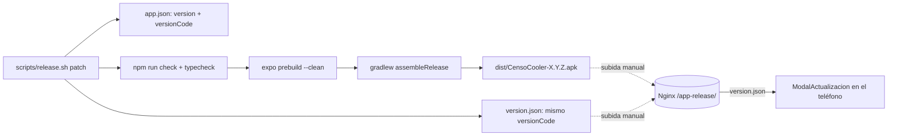

# 📦 Build del APK y auto-actualización

`COMPILAR.md` (raíz del repo) es la **fuente de verdad** del procedimiento manual: requisitos, JDK,
firma, variantes de Gradle. Este documento cubre lo que ese archivo no: cómo lo automatiza
`scripts/release.sh` y cómo llega la versión nueva al teléfono del inspector.

## El camino completo de una versión



## `scripts/release.sh`

```bash
./scripts/release.sh                      # 1.0.3 -> 1.0.4
./scripts/release.sh minor                # 1.0.3 -> 1.1.0
./scripts/release.sh 2.0.0                # versión explícita
./scripts/release.sh patch "• Arregla X"  # con changelog para version.json
```

Qué hace, en orden:

1. **Verifica JDK 17 y Android SDK** (`$JAVA_HOME`, `$ANDROID_HOME`, con defaults
   `~/jdks/jdk-17.0.13+11` y `~/Android/Sdk`). Si no están, corta antes de gastar un build.
2. **Calcula la versión nueva** desde `app.json` (`major|minor|patch|X.Y.Z`).
3. **Escribe los dos JSON de una sola vez**: `app.json` (`expo.version` y
   `expo.android.versionCode + 1`) y `version.json` (mismo `versionCode`, `versionName`,
   `apkUrl: CensoCooler-X.Y.Z.apk`, y el changelog si se pasó).
4. **Avisa si el `.env` quedó en `EXPO_PUBLIC_USE_MOCK=true`** y pide confirmación — el `.env` se
   embebe en el bundle y saldría un APK con datos simulados.
5. Corre `npm run check` y `npm run typecheck`.
6. `npx expo prebuild --platform android --clean`, escribe `android/local.properties` y
   `./gradlew assembleRelease`.
7. **Verifica que el `build.gradle` generado tenga el `versionCode` esperado** y que el APK exista.
8. Copia el resultado a `dist/CensoCooler-X.Y.Z.apk` y recuerda el paso manual que falta.

> ⚠️ **El script NO sube nada.** Publicar es manual: copiar el `.apk` **y** el `version.json` a
> `https://files.censo.aaocsa.com/app-release/`. Si subes el APK y olvidas el JSON, nadie recibe la
> actualización; si el JSON anuncia un `versionCode` mayor al del APK publicado, **todos ven el
> aviso para siempre** (y con `forceUpdate: true` quedan bloqueados).

> ⚠️ **`--clean` regenera `android/` desde cero**, y con él el `debug.keystore` que firma el APK.
> Firma distinta = el teléfono rechaza la actualización sobre una instalación previa ("app no
> instalada") y hay que desinstalar antes. Es la razón concreta por la que hace falta un keystore
> propio guardado fuera de `android/` (`COMPILAR.md` §4, pendiente).

`dist/` está en `.gitignore`: los APK no se versionan.

## `version.json`

Lo que sirve el Nginx, y lo que el repo mantiene como plantilla:

```json
{
  "versionCode": 4,
  "versionName": "1.0.3",
  "apkUrl": "CensoCooler-1.0.3.apk",
  "whatsNew": "• Cambio uno\n• Cambio dos",
  "forceUpdate": false
}
```

| Campo | Obligatorio | Notas |
|---|---|---|
| `versionCode` | Sí | Entero > 0. **Es el que manda al comparar**, no `versionName` |
| `apkUrl` | Sí | Relativa cuelga de `EXPO_PUBLIC_UPDATE_URL`; absoluta (`https://…`) se respeta |
| `versionName` | No | Solo para mostrar; si falta se usa el `versionCode` |
| `whatsNew` | No | Changelog que ve el inspector; `\n` para saltos de línea |
| `forceUpdate` | No | Solo el booleano `true` bloquea; la cadena `"true"` **no** cuenta |

Si falta `versionCode` o `apkUrl`, `normalizarVersion()` devuelve `null` y el modal no aparece.

> `[TODO: el `version.json` del repo tiene el changelog placeholder "• Cambio uno\n• Cambio dos".
> Antes de publicar la 1.0.3 hay que reemplazarlo por notas reales — o pasarlas como segundo
> argumento a `release.sh`, que las escribe solo.]`

> `[TODO: `README.md` en la raíz dice "debe decir 3 / 1.0.2" en el paso de verificación, pero
> `app.json` ya va en versionCode 4 / 1.0.3. Ese README quedó atrás de un release.]`

## Cómo lo consume la app

`src/api/updates.ts` (lógica) + `src/ui/ModalActualizacion.tsx` (UI, montado una vez en
`app/_layout.tsx`). El detalle de estados y errores está en
[03-FLUJOS.md](03-FLUJOS.md) § *Flujo 4*. Lo esencial:

- Compara `versionCode` remoto contra `Application.nativeBuildVersion` (el `versionCode` instalado).
- Falla en silencio si el servidor de updates no responde: censar es más importante que actualizar.
- Descarga el APK a la caché (`censo-<versionCode>.apk`, `idempotent: true`) y lo abre con
  `INSTALL_PACKAGE` sobre un `content://` — un `file://` truena con `FileUriExposedException` desde
  Android 7.

**Por qué no `react-native-update-apk`**: no tiene config plugin, así que obligaría a editar
`android/` a mano — y `prebuild` lo pisa. `expo-file-system` ya trae descarga con progreso **y** su
propio FileProvider (`${applicationId}.FileSystemFileProvider`, con `cache-path`), y
`expo-intent-launcher` lanza el intent. El único cambio nativo necesario es
`android.permissions: ["REQUEST_INSTALL_PACKAGES"]` en `app.json`, que `prebuild` aplica solo.

## Checklist de publicación

1. `.env` con `EXPO_PUBLIC_USE_MOCK=false` y la `EXPO_PUBLIC_API_URL` productiva.
2. `./scripts/release.sh patch "• …"`.
3. Verificar el APK: `aapt2 dump badging dist/CensoCooler-X.Y.Z.apk | grep -E "^package"`.
4. Probar la instalación por USB (`adb install -r`).
5. Subir `dist/CensoCooler-X.Y.Z.apk` **y** `version.json` al Nginx.
6. Confirmar desde el teléfono: `curl {UPDATE_URL}/version.json` y que la descarga del APK responda
   200.
7. Commit de `app.json` + `version.json` (el APK no se versiona).
