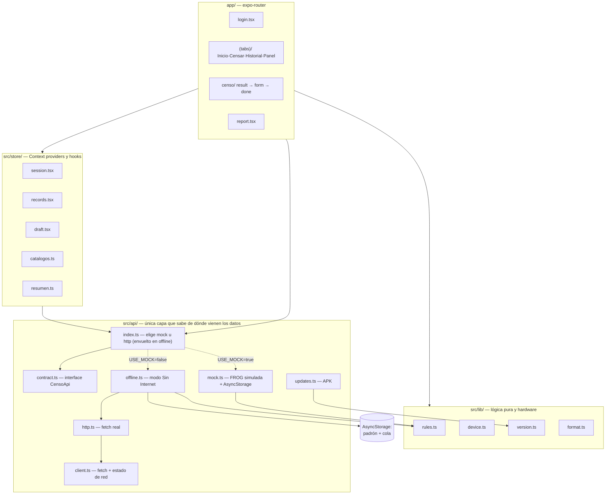

# Censo de Enfriadores — Documentación

📱 App móvil (Expo / React Native, Android) para el censo nacional de enfriadores. Un inspector
escanea la serie de un equipo, la app lo consulta en **FROG** (base corporativa), valida o corrige
sus datos, responde el censo con foto y GPS, y lo guarda dejándolo `Censado = SI`.

Arranca con datos simulados; el backend real se conecta cambiando un archivo `.env`
(ver [07-CONFIGURACION](07-CONFIGURACION.md)). La implementación HTTP (`src/api/http.ts`) ya está
escrita contra los endpoints reales acordados y **contiene mapeos que solo tienen sentido con el
backend que existe hoy** — ver [05-API](05-API.md).

> Esta carpeta se generó leyendo el código real. Lo que no se pudo confirmar leyendo estática está
> marcado `[TODO: …]`.

## Índice

| Doc | Contenido |
|---|---|
| [01-ESTRUCTURA.md](01-ESTRUCTURA.md) | Árbol de carpetas, archivos clave, convenciones, puntos de entrada |
| [02-ARQUITECTURA.md](02-ARQUITECTURA.md) | Capas, flujo de guardado paso a paso, detección de red, decisiones técnicas |
| [03-FLUJOS.md](03-FLUJOS.md) | Los 5 flujos (sesión, censar, reporte, auto-actualización, modo offline) con diagramas |
| [04-DATOS.md](04-DATOS.md) | Modelo de dominio, tipos del backend (`FrogRow`, `Cooler`), persistencia, seed |
| [05-API.md](05-API.md) | El contrato `CensoApi`, sus 10 métodos, endpoints reales y sus gotchas |
| [06-DEPENDENCIAS.md](06-DEPENDENCIAS.md) | Librerías usadas y para qué, deps declaradas sin usar |
| [07-CONFIGURACION.md](07-CONFIGURACION.md) | Las 5 variables de entorno, cómo conectar el backend |
| [08-TESTING.md](08-TESTING.md) | `npm run check`, qué cubre y qué no |
| [09-DEBUGGING.md](09-DEBUGGING.md) | Errores comunes, cómo depurar en campo |
| [10-ONBOARDING.md](10-ONBOARDING.md) | Setup, primeros tickets, glosario |
| [11-BUILD-Y-ACTUALIZACIONES.md](11-BUILD-Y-ACTUALIZACIONES.md) | APK con Gradle, `scripts/release.sh`, auto-actualización |
| [12-MODO-OFFLINE.md](12-MODO-OFFLINE.md) | **Modo Sin Internet**: padrón precargado, cola de censos, sincronización. Doc de mantenimiento |

## Qué hace el proyecto

Es el port a Expo/React Native de una demo HTML/CSS/JS (`../AppCensoEnfriadores_DEMO/`). Cubre las
pantallas de esa demo y las 7 reglas de negocio del documento funcional
`SISTEMA DE CENSO DE ENFRIADORES.md`, todas centralizadas en `src/lib/rules.ts` como funciones puras
verificadas por `npm run check`.

Desde el port original la app creció con cosas que la demo no tenía: escaneo real de código de
barras, subida de evidencias al servidor, reporte generado en el backend (PDF/Excel por URL),
historial en tres modos (censados / FROG / faltantes), banner de red, auto-actualización del APK y
**modo Sin Internet** con padrón precargado y cola de censos ([12-MODO-OFFLINE.md](12-MODO-OFFLINE.md)).

## Stack tecnológico

| Paquete | Versión | Rol |
|---|---|---|
| `expo` | ~57.0.8 | Runtime y toolchain |
| `expo-router` | ~57.0.8 | Navegación file-based |
| `react` | 19.2.3 | UI |
| `react-native` | 0.86.0 | Runtime nativo |
| `typescript` | ~6.0.3 | Tipado (`tsc --noEmit`, sin test runner) |
| `@react-native-async-storage/async-storage` | 2.2.0 | Persistencia local (mock + sesión) |
| `@react-native-community/netinfo` | 12.0.1 (pineado) | Sondeo de `/health` para el banner de red |
| `expo-camera` | ~57.0.3 | Escaneo de código de barras |
| `expo-image-picker` | ~57.0.6 | Foto de evidencia |
| `expo-location` | ~57.0.6 | GPS del levantamiento |
| `expo-file-system` | ~57.0.1 | Subida multipart, descarga de reporte y de APK |
| `expo-sharing` | ~57.0.7 | Compartir el reporte descargado |
| `expo-application` / `expo-intent-launcher` | ~57.0.x | Auto-actualización del APK |
| `react-native-qrcode-svg` + `react-native-svg` | ^6.3.21 / ^15.15.4 | QR con la URL del reporte |
| `@expo/vector-icons` | ^15.0.2 | Iconografía (Ionicons) |

Sin librería de estado (Redux/Zustand) ni de UI (no hay NativeBase/Tamagui): Context API +
`StyleSheet` a propósito — la demo original define su propio lenguaje visual y el dominio es
pequeño. Detalle y deps declaradas sin usar en [06-DEPENDENCIAS.md](06-DEPENDENCIAS.md).

## Arquitectura de alto nivel

**Regla dura**: las pantallas solo llaman a `api.*`. Ningún `.tsx` hace `fetch` ni conoce datos
simulados directamente — eso vive exclusivamente en `src/api/` (`updates.ts` incluido: la
auto-actualización también hace su fetch ahí, no en el modal).
