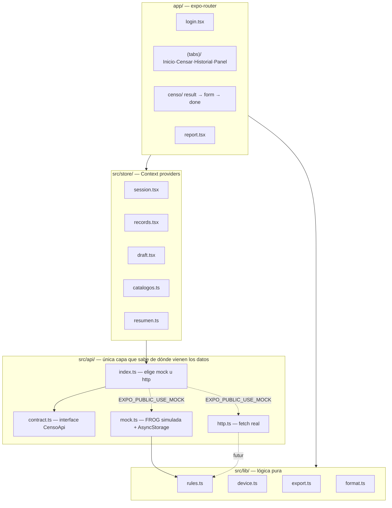

# Censo de Enfriadores — Documentación

📱 App móvil (Expo / React Native) para el censo nacional de enfriadores. Un inspector escanea la
serie de un equipo, la app lo consulta en **FROG** (base corporativa), valida o corrige sus datos,
responde el censo con foto y GPS, y lo guarda dejándolo `Censado = SI`. Hoy corre 100% con datos
simulados; el backend real se conecta cambiando un archivo `.env` (ver [07-CONFIGURACION](07-CONFIGURACION.md)).

## Índice

| Doc | Contenido |
|---|---|
| [01-ESTRUCTURA.md](01-ESTRUCTURA.md) | Árbol de carpetas, archivos clave, convenciones, puntos de entrada |
| [02-ARQUITECTURA.md](02-ARQUITECTURA.md) | Patrón arquitectónico, capas, flujo de una pantalla típica, decisiones técnicas |
| [03-FLUJOS.md](03-FLUJOS.md) | Los 3 flujos de negocio (censar, reportar, sesión) paso a paso con diagramas |
| [04-DATOS.md](04-DATOS.md) | Modelo de dominio, entidades, persistencia, seed |
| [05-API.md](05-API.md) | El contrato `CensoApi`, sus 8 métodos, endpoints REST esperados |
| [06-DEPENDENCIAS.md](06-DEPENDENCIAS.md) | Librerías usadas y para qué, infraestructura |
| [07-CONFIGURACION.md](07-CONFIGURACION.md) | Variables de entorno, cómo conectar el backend real |
| [08-TESTING.md](08-TESTING.md) | `npm run check`, qué cubre y qué no |
| [09-DEBUGGING.md](09-DEBUGGING.md) | Errores comunes, cómo depurar en campo |
| [10-ONBOARDING.md](10-ONBOARDING.md) | Setup, primeros tickets, glosario |

## Qué hace el proyecto

Es el port 1:1 a Expo/React Native de una demo HTML/CSS/JS (`../AppCensoEnfriadores_DEMO/`). Cubre
las 9 pantallas de esa demo y las 7 reglas de negocio del documento funcional
`SISTEMA DE CENSO DE ENFRIADORES.md`, todas centralizadas en `src/lib/rules.ts` como funciones puras
verificadas por `npm run check`.

## Stack tecnológico

| Paquete | Versión | Rol |
|---|---|---|
| `expo` | ~57.0.8 | Runtime y toolchain |
| `expo-router` | ~57.0.8 | Navegación file-based |
| `react` | 19.2.3 | UI |
| `react-native` | 0.86.0 | Runtime nativo |
| `typescript` | ~6.0.3 | Tipado (`tsc --noEmit`, sin test runner) |
| `@react-native-async-storage/async-storage` | 2.2.0 | Persistencia local (mock + sesión) |
| `expo-camera` | ~57.0.3 | Escaneo de código de barras |
| `expo-image-picker` | ~57.0.6 | Foto de evidencia |
| `expo-location` | ~57.0.6 | GPS del levantamiento |
| `expo-print` / `expo-sharing` / `expo-file-system` | ~57.0.x | Exportar reporte a PDF/CSV y compartirlo |
| `@expo/vector-icons` | ^15.0.2 | Iconografía (Ionicons) |

Sin librería de estado (Redux/Zustand) ni de UI (no hay NativeBase/Tamagui): Context API +
`StyleSheet` a propósito — la demo original define su propio lenguaje visual y el dominio es
pequeño.

## Arquitectura de alto nivel

**Regla dura**: las pantallas solo llaman a `api.*`. Ningún `.tsx` hace `fetch` ni conoce datos
simulados directamente — eso vive exclusivamente en `src/api/`.
